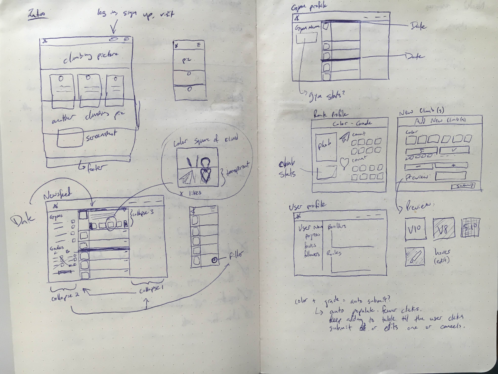
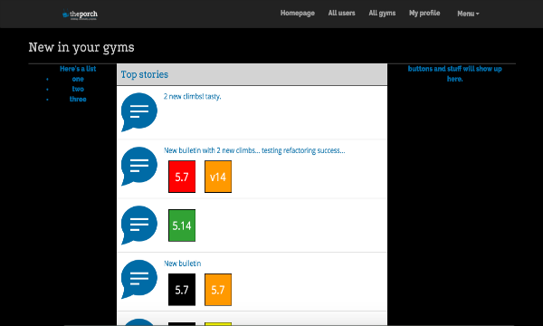

# Gym News

## Hosted on Github pages

View app/API here: 
  [Gym News: Client](http://apalmer0.github.io/gym-news-front-end/index.html)
   
  [Gym News: API](https://gym-news.herokuapp.com/)

## Front End Mockups

Pageviews:
  

## Live Screenshot

  

## About

-   At its heart, this project is a very basic app for allowing climbing gyms to
    create news stories for members - these stories can be anything, but the app
    is built such that they can include new rock climbs that have been created
    in the gym recently, allowing their members to stay in touch with the latest
    updates at the gym.

    Currently, a user can create an account and login/logout, create a new gym,
    create a news story for that gym - including one or more climbs - and view
    the news story in a newsfeed.

-   Things I would do with more time:

    -   Refactor my code. Despite setting out to be clearer this time around,
        the code quickly degenerated into a long and hard to follow tangle. The
        first thing I'll do is introduce multiple files to separate tasks.
         **UPDATE Done!** Code has been broken up into multiple files for
      improved readability. Woot!
    -   Improve the user interface to accomodate some features that are fully
        built, but not available to the front end user. This includes things
        like 'favoriting' of climbs, which has been built but not incorporated
        into the layout.
    -   Add in some new features like subscriptions and ascent recording.

## Code

-   This app is written with javascript, ajax, handlebars, html, sass, and css
